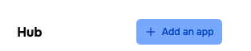
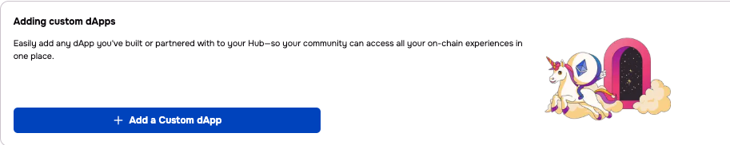
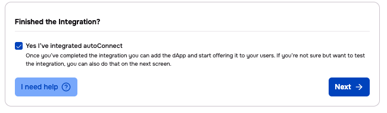
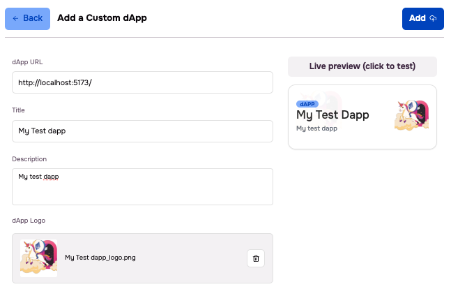

# ConnectToUs - Unicorn.eth dApp Integration

> **One-click wallet connection for the next generation of secure Web3 experiences**

[](https://badge.fury.io/js/unicorn-connect)
[](https://opensource.org/licenses/MIT)

## 🦄 What is ConnectToUs?

ConnectToUs enables seamless integration between your dApp and Unicorn.eth smart account wallets. By implementing our autoConnect functionality, you can:

- **Eliminate wallet connection friction** - Users connect instantly without manual wallet selection
- **Ensure maximum security** - Only whitelisted dApps can connect to Unicorn wallets
- **Handle chain switching automatically** - No more network configuration headaches
- **Get listed in App Centers** - Qualified dApps appear in community app stores like ETHDenver

## 🚀 Quick Start

### Prerequisites
- Node.js 16+ 
- A dApp you want to connect to Unicorn wallets
- Basic knowledge of React or your chosen framework

### Installation

```bash
npm install thirdweb
```

### 5-Minute Integration

**Step 1: Wrap your app**
```jsx
import { ThirdwebProvider } from "thirdweb/react";

function App() {
  return (
    <ThirdwebProvider>
      {/* Your app content */}
    </ThirdwebProvider>
  );
}
```

**Step 2: Add AutoConnect**
```jsx
import { createThirdwebClient } from "thirdweb";
import { AutoConnect } from "thirdweb/react";
import { inAppWallet } from "thirdweb/wallets";
import { polygon } from "thirdweb/chains";

const client = createThirdwebClient({ 
  clientId: "4e8c81182c3709ee441e30d776223354" 
});

const wallets = [
  inAppWallet({
    smartAccount: {
      factoryAddress: "0xD771615c873ba5a2149D5312448cE01D677Ee48A",
      chain: polygon,
      gasless: true,
    }
  })
];

function App() {
  return (
    <ThirdwebProvider>
      <AutoConnect client={client} wallets={wallets} />
      {/* Your app content */}
    </ThirdwebProvider>
  );
}
```
**Step 3: Test your dapp**

We make it easy to test your dapp.

1. log in to your community at https://admin.myunicornaccount.com/login ( You can create a free starter account for this purpose)
2. Navigate to the "My Community" page
3. Click - "Add an app"

4. Click - "Add a custom dApp" button at the bottom of the page

5. Click - "Yes, I've finished the Integration?" checkbox (We know you haven't yet, that's why you are testing)

6. Click - "Next"
7. Enter the dApp url, Title, Description, and a logo (local address is ok for testing)
    
8. Now you can click on the Live Preview link to the right to test!

**Step 4: Submit for App Center approval**

Fill out [this form](https://forms.gle/3kyuEce2fZtd7Umy9) to get your dApp reviewed for inclusion in Unicorn App Centers.

## 📋 Integration Options

Choose the integration method that matches your current tech stack:

| Method | Best For | Setup Time | Complexity |
|--------|----------|------------|------------|
| [Pure Thirdweb](#pure-thirdweb-sdk) | New projects, Thirdweb users | 5 minutes | ⭐ |
| [Wagmi Adapter](#wagmi-adapter) | Existing Wagmi/RainbowKit projects | 10 minutes | ⭐⭐ |
| [Framework Agnostic](#framework-agnostic) | Vue, Angular, vanilla JS | 15 minutes | ⭐⭐⭐ |

---

## 🔧 Detailed Integration Guides

### Pure Thirdweb SDK

**Perfect for:** Projects already using Thirdweb or starting fresh

```jsx
import { ThirdwebProvider } from "thirdweb/react";
import { createThirdwebClient } from "thirdweb";
import { AutoConnect } from "thirdweb/react";
import { inAppWallet } from "thirdweb/wallets";
import { polygon } from "thirdweb/chains";

// Configuration
const client = createThirdwebClient({
  clientId: "4e8c81182c3709ee441e30d776223354",
});

const supportedWallets = [
  inAppWallet({
    smartAccount: {
      factoryAddress: "0xD771615c873ba5a2149D5312448cE01D677Ee48A",
      chain: polygon,
      gasless: true,
    }
  })
];

// App setup
function App() {
  return (
    <ThirdwebProvider>
      <AutoConnect 
        client={client} 
        wallets={supportedWallets}
        onConnect={(wallet) => {
          console.log("Connected to Unicorn wallet:", wallet.getAddress());
        }}
      />
      <YourAppContent />
    </ThirdwebProvider>
  );
}
```

### Wagmi Adapter

**Perfect for:** Existing projects using Wagmi, RainbowKit, or similar React hooks

```bash
npm install thirdweb @thirdweb-dev/wagmi-adapter
```

```jsx
import { createThirdwebClient } from "thirdweb";
import { createConfig, http } from "wagmi";
import { inAppWalletConnector } from "@thirdweb-dev/wagmi-adapter";
import { polygon } from "wagmi/chains";
import { WagmiProvider } from "wagmi";
import { QueryClient, QueryClientProvider } from "@tanstack/react-query";

const client = createThirdwebClient({
  clientId: "4e8c81182c3709ee441e30d776223354",
});

export const config = createConfig({
  chains: [polygon],
  connectors: [
    inAppWalletConnector({
      client,
      smartAccount: {
        sponsorGas: true,
        chain: polygon,
        factoryAddress: "0xD771615c873ba5a2149D5312448cE01D677Ee48A",
      },
    }),
  ],
  transports: {
    [polygon.id]: http(),
  },
});

const queryClient = new QueryClient();

function App() {
  return (
    <WagmiProvider config={config}>
      <QueryClientProvider client={queryClient}>
        <YourAppContent />
      </QueryClientProvider>
    </WagmiProvider>
  );
}
```

You can find a working example of [React + wagmi Example](./examples/react-wagmi/) in our examples.

It automatically reads the url params once you come from Unicorn.eth and connects you. You can also concatenate the params manually to your localhost url to test things out.(`http://localhost:5174/?walletId=inApp&authCookie=eyJhbGciOiJSUzI1NiIsI...`)

### Framework Agnostic

**Perfect for:** Vue, Angular, vanilla JavaScript, or any non-React framework

```javascript
import { createThirdwebClient } from "thirdweb";
import { polygon } from "thirdweb/chains";
import { autoConnect, EIP1193 } from "thirdweb/wallets";

const client = createThirdwebClient({
  clientId: "4e8c81182c3709ee441e30d776223354",
});

// Auto-connect and get EIP-1193 provider
async function connectUnicornWallet() {
  try {
    const wallet = await autoConnect({
      client,
      accountAbstraction: {
        chain: polygon,
        sponsorGas: true,
        factoryAddress: "0xD771615c873ba5a2149D5312448cE01D677Ee48A",
      },
      onConnect: (connectedWallet) => {
        console.log("Connected to Unicorn wallet!");
        
        // Convert to EIP-1193 provider for use with web3 libraries
        const provider = EIP1193.toProvider({
          wallet: connectedWallet,
          chain: polygon,
          client,
        });
        
        // Now use this provider with your preferred web3 library
        // ethers.js: new ethers.providers.Web3Provider(provider)
        // web3.js: new Web3(provider)
        
        return provider;
      },
    });
    
    return wallet;
  } catch (error) {
    console.error("Failed to connect:", error);
    throw error;
  }
}

// Use in your app
connectUnicornWallet()
  .then(wallet => {
    // Wallet connected successfully
    console.log("Ready to interact with blockchain!");
  })
  .catch(error => {
    // Handle connection errors
    console.error("Connection failed:", error.message);
  });
```

## 🛡️ Server-side Changes

Until now, we only looked at how to integrate with Unicorn.eth on the client-side, however there is a minor change that you might want to make it to your application's server-side as well.

Many applications use signature validation to log-in and authenticate web3 users. If you've only been accepting EOA accounts (e.g., regular Ethereum wallets on Metamask), your server might not be able to validate signatures coming from users on Unicorn as Unicorn wallets use Account Abstraction. 

First let's have a quick primer on different signature validation schemes on Ethereum:

> 1. EOA Signature Validation
> 
> For a standard Externally Owned Account (EOA), validation is a
> cryptographic process. A user signs a message hash with their private
> key using the ECDSA algorithm. To verify, a smart contract uses the
> built-in ecrecover function. This function takes the message hash and
> the signature, and it returns the public address of the account that
> signed it. If this recovered address matches the expected signer's
> address, the signature is valid.
> 
>   
> 
> 2. ERC-1271: Signatures for Smart Contracts
> 
> Smart contracts don't have private keys, so they can't sign messages
> like EOAs. ERC-1271 provides a standard for smart contracts to declare
> a signature valid for themselves.
> 
> A contract implementing this standard has a function:
> isValidSignature(bytes32 _hash, bytes memory _signature). When a
> verifier wants to check a signature from a smart contract wallet, it
> calls this function on the wallet's address. The wallet then runs its
> own internal logic—like checking if enough multi-sig owners have
> signed—and returns a magic value (0x1626ba7e) if the signature is
> valid.
> 
>   
> 
> 3. ERC-6492: Signature Validation for Undeployed Contracts
> 
> What if a smart contract wallet hasn't been deployed yet (a
> "counterfactual" account)? You can't call isValidSignature on an
> address with no code.
> 
> ERC-6492 solves this by creating a "wrapped" signature. The signature
> is bundled with the information needed to deploy the contract (its
> factory address and creation data). A verifier first checks if the
> signing address has code. If not, it looks for this wrapper. If found,
> it can use the data to simulate the deployment and then call
> isValidSignature on the simulated contract. This allows for validating
> signatures from accounts that will be created in the future.

For Unicorn.eth, we mainly deal with ERC-1271 and ERC-6492.

There are many solutions aimed at doing all these 3 signature validations together.

If you're already using `thirdweb` on your server-side, you can use [`verifySignature`](https://portal.thirdweb.com/references/typescript/v5/verifySignature).

If not, you can use standalone solutions such as [@ambire/signature-validator](https://www.npmjs.com/package/@ambire/signature-validator).

You can also maintain a solution yourself as it's not going to take more than a couple dozen lines of code. ([ambire implementation](https://github.com/AmbireTech/signature-validator/blob/main/index.ts))

[Viem](https://viem.sh/docs/actions/public/verifyTypedData.html) also seems to have started supporting ERC-6492 signatures recently.


## 🔍 Testing Your Integration

### Local Testing Checklist

- [ ] AutoConnect component renders without errors
- [ ] Wallet connection triggers automatically on app load
- [ ] User can see their wallet address after connection
- [ ] Transactions work correctly (try a simple contract interaction)
- [ ] Chain switching works if your dApp supports multiple networks
- [ ] Error handling works for connection failures

### Debug Common Issues

**Connection fails silently:**
```javascript
// Add error handling to catch issues
<AutoConnect 
  client={client} 
  wallets={wallets}
  onConnect={(wallet) => console.log("✅ Connected:", wallet)}
  onError={(error) => console.error("❌ Connection failed:", error)}
/>
```

**Wrong network connected:**
```javascript
// Verify chain configuration matches your dApp's requirements
const accountAbstraction = {
  factoryAddress: "0xD771615c873ba5a2149D5312448cE01D677Ee48A",
  chain: polygon, // Make sure this matches your target network
  gasless: true,
};
```


## 🏪 App Center Submission

Once your integration is complete:

1. **Test thoroughly** using the checklist above
2. **Deploy your dApp** to a public URL
3. **Fill out the submission form** with details about your dApp
4. **Wait for review** - typical approval time is 1-2 weeks
5. **Get notified** when your dApp is live in App Centers

### Submission Requirements

- ✅ Working autoConnect integration
- ✅ Deployed dApp with public URL  
- ✅ Clear description of dApp functionality
- ✅ Proper error handling for connection failures
- ✅ Mobile-responsive design (recommended)

## 🤝 Support & Community

- **Documentation Issues:** [Create an issue](https://github.com/MyUnicornAccount/ConnectToUs/issues)
- **Integration Help:** [Join our Discord](https://discord.gg/unicorn-developers)
- **App Center Questions:** Email app-center@unicorn.eth

## 📜 License

MIT License - see [LICENSE](LICENSE) file for details.

---

## 🔗 Quick Links

- [Thirdweb Documentation](https://portal.thirdweb.com/)
- [App Center Submission Form](https://forms.gle/3kyuEce2fZtd7Umy9)
- [Example dApp Repository](https://github.com/MyUnicornAccount/unicorn-dapp-example)
- [Unicorn.eth Website](https://unicorn.eth)
